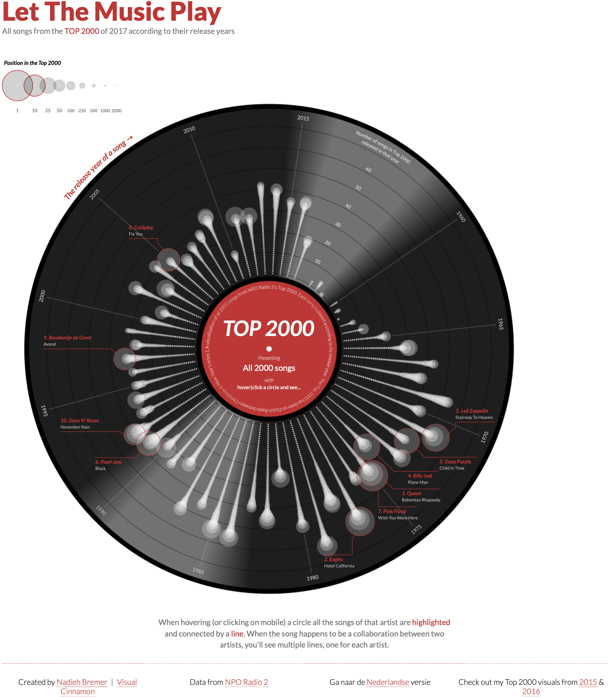

```{r setup, include=FALSE}
knitr::opts_chunk$set(echo = TRUE, message = FALSE, warning = FALSE, error = FALSE,
                      fig.width=10, fig.height=10, fig.align = 'center', out.width='90%', dev = 'pdf')
```

****

In this paper, I explore the concept of layering in data graphics. I demonstrate layering by coding a sample graphic one layer at a time, and implement this demonstration using R and its libraries. The example xenographic encodes music preferences among Dutch residents, of which the data and encoding were previously explored by Nadieh Bremer in her graphic,

```{r, out.width='80%', echo=FALSE}

```
which I invite you to first explore: [https://www.visualcinnamon.com/portfolio/top-2000-let-music-play](https://www.visualcinnamon.com/portfolio/top-2000-let-music-play).

I use the data she collected and parallel her interactive design, coded in `d3.js`, except I focus on a static version coded exclusively in `R` and its packages. I leave as an exercise for you to compare our `R` code with Nadieh's `d3.js` code, and to consider the limitations and benefits of each. 

# Load `R` packages and gather data

For this exercise, I use four libraries:

```{r}
library(dplyr)
library(ggplot2)
library(ggrepel)
library(ggtext) 
```

The first, `dplyr`, is merely to prepare data in an intuitive way. That package, along with the base graphing package `ggplot2` is, perhaps, the most used among options in `R`'s ecosystem. `ggplot2`, as its name implies, is designed from Wilkinson's _The Grammar of Graphics_. The final two packages, `ggrepel` and `ggtext` provide add-on functionality for `ggplot2`, namely, we can use the former to prevent text from overlapping and the latter to format text with `html` or `markdown` syntax, or both. In our code I draw shapes and encode Nadieh's data that she originally gathered for her project. Be sure to thank her for sharing!

```{r}
top2000_2017_rank <- 
  read.csv(paste0("https://raw.githubusercontent.com/nbremer/",
                  "top2000vinyl/gh-pages/data/top2000_2017_rank.csv"),
           stringsAsFactors = F)
```

The data includes `rank`, `title`, `artist`, and `releaseYear`, shown below with the top ten songs in the list of 2000:

```{r, echo=FALSE}
knitr::kable(head(top2000_2017_rank, n=10), booktabs = T) %>%
  kableExtra::kable_styling(position = "center")
```

To follow Nadieh's graphic, we need to calculate the order among songs for each released year, and create a size for one of the glyphs --- the semi-transparent white circles on her graphic --- which is based on total rank where number `1` is most popular and number `2000` is last among those on the list. Of note, I iteratively worked out how to size this glyph, scaling rankings (1, 2000) to (2, 40). I converted ranking to the log scale in the mapping so that size would increase non-linearly for the top songs. Thus, in the formula for size ($\textrm{sz} \sim 40 - 5.26 \cdot \log(\textrm{rank})$), when the song is ranked first, `log(1)` its size is 40, and for each song lower on the list glyph size decreases non-linearly. Finally, I included an aribrary scale variable `scale_circle` and adjusted its value until I liked the sizing:

```{r}
scale_circle <- 1.8

df <- top2000_2017_rank %>% 
  arrange(desc(rank)) %>% 
  group_by(releaseYear) %>% 
  mutate(n = row_number()) %>% 
  mutate(sz = (40 + -5.26 * log(rank)) / scale_circle )
```

In Nadieh's graphic, she highlights the top 10 songs in her graphic. Our approach was to create a second data frame with just the top 10 songs and use both data sets in the graphics,

```{r}
df10 <- df %>% filter(rank < 11)
```

though it's also just as easy to use the full data set and filter in the plotting functions as needed. Our final step in preparation is to create labels for the x-axis of Nadieh's graphic.

```{r}
datelabels <- seq(1960, 2015, by = 5)
```

We're ready, now to explore layering while coding a static approximation of her graphic.

# Code the plot!

## Specify data boundaries and coordinate system

First, we setup the basic plotting environment with the `ggplot` function, set the data boundaries of the graphic, and change to polar coordinates:

```{r}
p <- ggplot(df) + 
  
  # remove all default theme settings
  theme_void(base_family = 'serif') +

  # set x and y bounds of plot
  scale_x_continuous(limits = c(1955, 2020)) +
  scale_y_continuous(limits = c(-40 , 80)) +

  # from cartesian to polar coordinates ----
  coord_polar()
```

Now I list the code for each layer, showing its result. The _order of the functions_ determine the layer of the graphical element returned by the function, _from background to foreground_.

\pagebreak

## Layers (non-data-ink)

### Red label

```{r}
p <- p +
  annotate('rect', 
           xmin = 1955, ymin = -40, 
           xmax = 2020, ymax = 0, 
           fill = '#c9172f') 
```

\vfill

```{r echo=FALSE}
p
```

\vspace{0.5\textheight}

\pagebreak

### Black vinyl

```{r}
p <- p +
  annotate('rect', 
           xmin = 1955, ymin = 0, 
           xmax = 2020, ymax = 80, 
           fill = '#333333') 
```

\vfill 

```{r echo=FALSE}
p
```

\vspace{0.5\textheight}

\pagebreak

### Shine or light reflection

```{r}
p <- p +
  # shine on upper/top
  annotate('rect', 
           xmin = seq(2018, 2020, by = .1), ymin = 0, 
           xmax = 2020, ymax = 80, 
           fill = '#555555', 
           alpha = seq(0, 1, by = 0.05))  +
  annotate('rect', 
           xmin = 1955, ymin = 0, 
           xmax = seq(1955, 1957, by = .1), ymax = 80, 
           fill = '#555555', 
           alpha = seq(1, 0, by = -0.05))  +
  
  # shine on lower/bottom
  annotate('rect', 
           xmin = seq(1985.5, 1987.5, by = .1), ymin = 0, 
           xmax = 1987.5, ymax = 80, 
           fill='#555555', 
           alpha = seq(0, 1, by = 0.05))  +
  annotate('rect', 
           xmin = 1987.5, ymin = 0, 
           xmax = seq(1987.5, 1989.5, by = .1), ymax = 80, 
           fill = '#555555', 
           alpha = seq(1, 0, by = -0.05))
```

\vfill 

```{r echo=FALSE}
p
```

\vspace{0.5\textheight}

\pagebreak

### Darker grooves

```{r}
p <- p +
  annotate('segment', 
           x = 1955, y = 0, 
           xend = 2020, yend = 0, 
           color = '#000000', 
           lwd = 3) +
  annotate('segment', 
           x = 1955, y = seq(0, 70, by = 10), 
           xend = 2020, yend = seq(0, 70, by = 10), 
           color = '#000000', 
           lwd = 0.2) +
  annotate('segment', 
           x = 1955, y = 80, 
           xend = 2020, yend = 80, 
           color = '#000000', 
           lwd = 3)
```

\vfill 

```{r echo=FALSE}
p
```

\vspace{0.5\textheight}

\pagebreak

### Y-axis: the number of top 2000 songs in release year

```{r}
p <- p +
  annotate('text', 
           x = 1955, y = seq(10, 60, by = 10)+2, 
           label = seq(10, 60, by = 10), 
           color = '#aaaaaa', 
           size = 6/.pt) +
  annotate('text', 
           x = 1955, y = 74, 
           label = 'Number of Top 2000\nreleased in that year', 
           lineheight = 0.8, 
           color = '#aaaaaa', 
           size = 6/.pt)
```

\vfill 

```{r echo=FALSE}
p
```

\vspace{0.5\textheight}

\pagebreak

### White hole in center of record

```{r}
p <- p +
  geom_point(aes(x = 1955, y = -40), 
             color = '#ffffff', 
             size = 4)
```

\vfill 

```{r echo=FALSE}
p
```

\vspace{0.5\textheight}

\pagebreak

### Text on red label

```{r}
p <- p +
  annotate('text', 
           x = 1955, y = -20, 
           label = 'TOP 2000', 
           fontface = 'bold.italic', 
           color = '#ffffff', 
           size = 20/.pt) +
  annotate('text', 
           x = 1955, y = -30, 
           label = 'ranked by Dutch music lovers', 
           fontface = 'bold.italic', 
           color = '#ffffff', 
           size = 9/.pt) +
  annotate('text', 
           x = 1987, y = -30, 
           label = 'Presenting', 
           color = '#dd8888', 
           size = 8/.pt) +
  annotate('text', 
           x = 1987, y = -20, 
           label = 'All 2000 songs', 
           color = '#ffffff', 
           size = 12/.pt)
```

\vfill 

```{r echo=FALSE}
p
```

\vspace{0.5\textheight}

\pagebreak

### X-axis: lines and text (years of release)

```{r}
p <- p +
  annotate('segment', 
           x = datelabels, y = 0, 
           xend = datelabels, yend = 70, 
           color = '#dddddd', 
           lwd = 0.1) +
  annotate('text', 
           x = datelabels, y = 75, 
           label = datelabels, 
           color = '#dddddd', 
           size = 6/.pt)
```

\vfill 

```{r echo=FALSE}
p
```

\vspace{0.5\textheight}

\pagebreak

## Layers (data-ink)

### All songs as white dots

```{r}
p <- p +
  geom_point(aes(x = releaseYear, y = n), 
             size = .1, 
             color = "#dddddd", 
             alpha = .85)
```

\vfill 

```{r echo=FALSE}
p
```

\vspace{0.5\textheight}

\pagebreak

### Songs as transparent circle rank encoded as calculated size of circle

```{r}
p <- p +
  geom_point(aes(x = releaseYear, y = n), 
             size = df$sz, 
             color = "#dddddd", 
             alpha = .15)
```

\vfill 

```{r echo=FALSE}
p
```

\vspace{0.5\textheight}

\pagebreak

### Label top 10 ranked songs with their artists and ranking

```{r}
p <- p +
  geom_text_repel(data = df10,
                  aes(x = releaseYear, y = n, 
                      label = paste0(rank, ". ", artist, "\n", title)), 
                  size = 8/.pt, 
                  force = 9, 
                  lineheight = 0.8, 
                  nudge_y = df10$sz,
                  color = "#FF1C3A", 
                  alpha = 1)
```

\vfill 

```{r echo=FALSE}
p
```

\vspace{0.5\textheight}

\pagebreak

### Highlight by encoding top 10 ranked songs as red ring 

```{r}
p <- p +
  geom_point(data = df10,
             aes(x = releaseYear, y = n), 
             size = df10$sz, 
             shape = 21,
             color = "#c9172f", 
             alpha = 1)
```

\vfill 

```{r echo=FALSE}
p
```

\vspace{0.5\textheight}

\pagebreak

## Specify title formatting and add text

```{r}
p <- p +
  theme(plot.title = element_text(size = 32, 
                                  face = "bold", 
                                  color = '#c9172f'),
        plot.subtitle = element_markdown(size = 16, 
                                         color = '#888888'),
        plot.caption = element_text(size = 10, 
                                    color = '#888888', 
                                    hjust = 1)) +
  labs(title = 'Let The Music Play',
       subtitle = 
         paste0("All songs from the <span style='color:#c9172f'>",
                "**TOP 2000**</span> of 2017 according to their release years"),
       caption = 
         paste0('Source: https://github.com/nbremer/top2000vinyl.',
                '\nCreated in R by Scott Spencer, Columbia University'))
```

\vfill 

```{r echo=FALSE}
p
```

\vspace{0.5\textheight}

\pagebreak

# Save plot

```{r}
ggsave(filename = 'vinyltop2000.pdf',
       device = 'pdf',
       plot = p, 
       height = 10, width = 10)
```

To see how ordering layers affects which elements are visible or occluded, reorder the code above, moving some layers before others and re-plotting the results.


